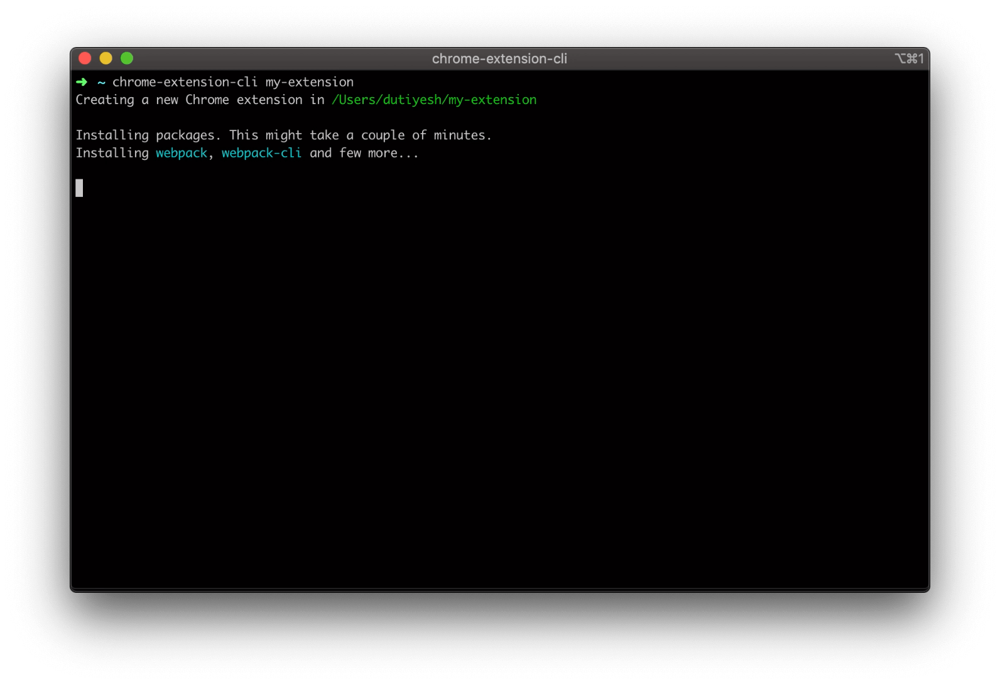
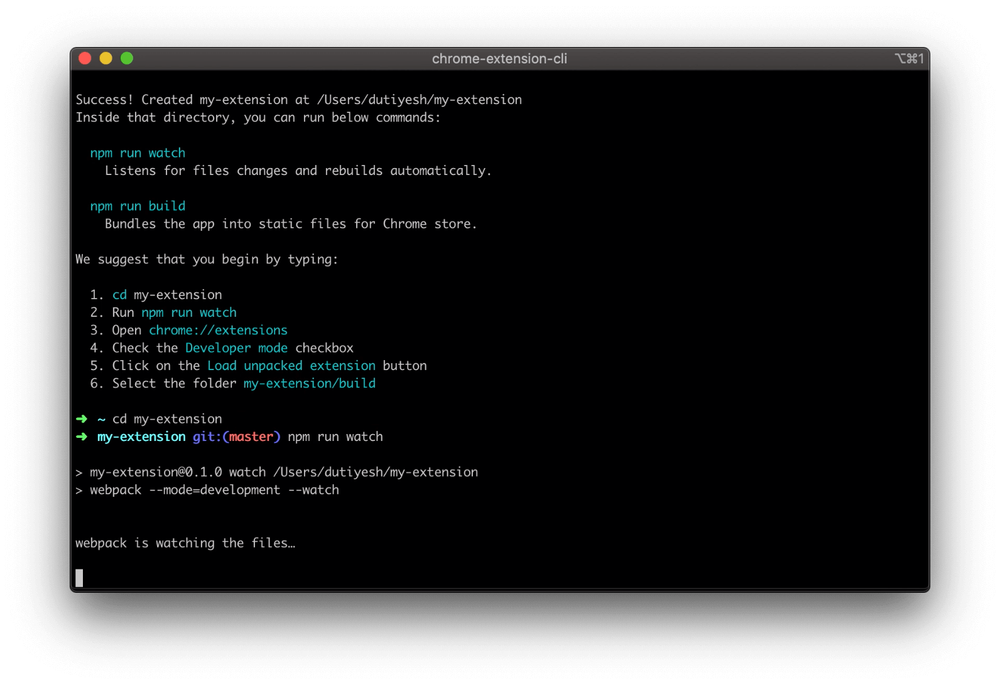

# React Chrome Extension CLI

The CLI next Chrome Extension. 🚀

## Quick Overview

```sh
npm install -g react-chrome-extension-cli
react-chrome-extension-cli my-extension
cd my-extension
npm run watch
```

Then follow these instructions to see your extension:
1. Open **chrome://extensions**
2. Check the **Developer mode** checkbox
3. Click on the **Load unpacked extension** button
4. Select the folder **my-extension/build**

When you're ready to publish to Chrome Web Store, create a minified bundle with `npm run build` and then zip the `build` folder.

<div align="center">
  
  
</div>

### Get Started Immediately

You **don’t** need to install or configure Webpack.<br>
Webpack comes in preconfigured, so that you can focus on the code.

Just create a project, and you’re good to go.

## Creating an Extension

### Installation

```sh
npm install -g react-chrome-extension-cli
```

### Usage

```sh
react-chrome-extension-cli <project-name>
```

Example:
```sh
react- chrome-extension-cli my-react-extension
```

It will create a directory called `my-extension` inside the current folder.

<br>
Inside that directory, it will generate the initial project structure and install the transitive dependencies, includes `React`, `Ant`

```
my-extension
├── README.md
├── node_modules
├── package.json
├── .gitignore
├── config                    // Webpack with minimal configurations
│   ├── paths.js
│   ├── webpack.common.js
│   └── webpack.config.js
├── public
│   ├── icons
│   │   ├── logo.png
│   ├── *.html                // HTML files will vary depending on extension type
│   └── manifest.json
└── src
    ├── *.css                 // CSS files will vary depending on extension type
    └── *.js                  // JS files will vary depending on extension type
```

Once the installation is done, you can open your project folder:

```sh
cd my-extension
```

Inside the newly created project, you can run some built-in commands:

### `npm run watch`

Runs the app in development mode.
> 一定要调整为开发者模式

<br>
Then follow these instructions to see your app:
1. Open **chrome://extensions**
2. Check the **Developer mode** checkbox
3. Click on the **Load unpacked extension** button
4. Select the folder **my-extension/build**

### `npm run build`

Builds the app for production to the build folder.<br>
Zip the build folder and your app is ready to be published on Chrome Web Store.
